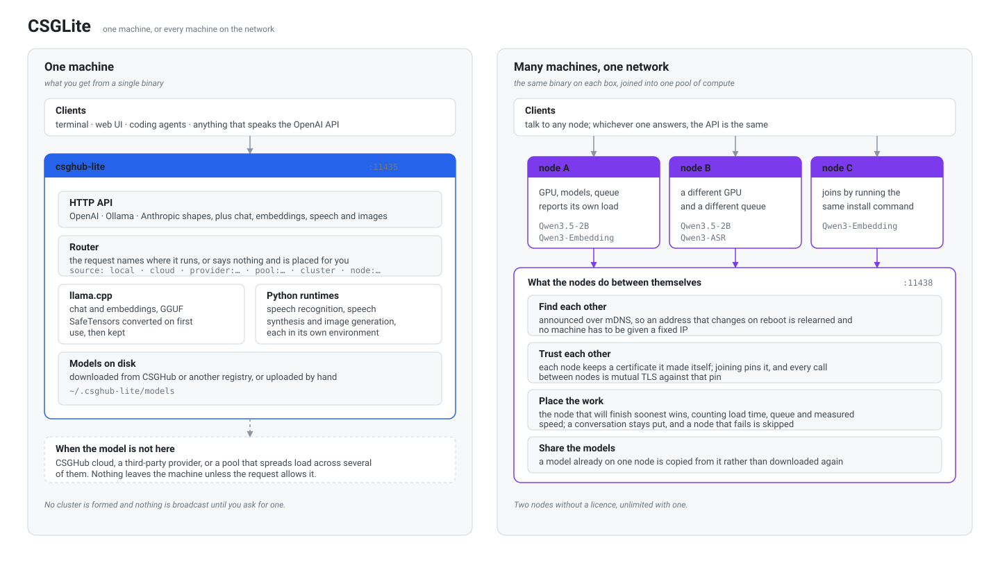

# CSGLite Enterprise Edition (EE) code

Everything under this directory is licensed under the CSGLite Enterprise
Edition License in [`LICENSE`](LICENSE), not under the Apache-2.0 license that
covers the rest of the repository. The licence is published in Chinese and
English; where the two differ, the Chinese text governs.

In short, and without replacing anything the licence itself says: you may read
the source and modify it for internal research, development and testing.
Production use needs a valid CSGLite Enterprise Edition licence from OpenCSG
matching your actual usage, and the licence defines production use broadly
enough to include a pilot or a proof of concept that carries real business.

The one exception is the community grant at the top of the licence: a feature
that runs without a licence may be used in production within the limit the
software enforces for unlicensed users, which for the LAN cluster is two nodes.
That is what makes the community node cap a real entitlement rather than
something the licence forbids.

Redistribution, sublicensing and offering the Software to third parties as a
hosted service are not permitted. Replacing the logo or the UI appearance, or
building anything commercial on the Software, requires written notice to
OpenCSG first, whether or not you hold a licence.

## The features that live here

### LAN compute cluster (`ee/cluster`)

<p align="center">
  
</p>

Several machines on one network become a single pool of compute. A request
arriving at any of them is served by whichever will finish it soonest, and the
API does not change: the same OpenAI, Ollama and Anthropic endpoints answer
whether one machine or five are behind them.

**Turning it on.** Give every machine the same secret and they find each other
and form a cluster with no create or join step:

```bash
csghub-lite config set cluster_secret "a-long-shared-secret"
csghub-lite config set cluster_name   "lab"
```

The equivalent environment variables are `CSGHUB_LITE_CLUSTER_SECRET` and
`CSGHUB_LITE_CLUSTER_NAME`, which is the usual way to bake it into an install
image. The cluster's identity is derived from the secret, and the secret itself
never goes on the wire. Pairing by join token (`csghub-lite cluster token`) or
by an eight-digit admission code works too, for anyone who would rather admit
each machine by hand.

**Without a secret nothing happens.** A machine that was never asked to cluster
opens no listener, sends no multicast and starts no polling goroutine. The
feature costs a single machine nothing.

**What it does once formed.**

- *Finds machines again after they move.* Nodes are identified by a UUID
  pinned to a self-signed certificate, announced over mDNS, so an address that
  changes on reboot is relearned on the next poll and no machine needs a fixed
  IP.
- *Places work by predicted completion time*, counting load time, queue depth
  and measured speed, with penalties for thermal throttling, power caps, CPU
  contention, RAM pressure and disk activity. A conversation sticks to the node
  that answered it; a node that fails is taken out and retried with backoff.
- *Copies models between nodes* rather than downloading them again, verified by
  a SHA-256 the sender computes as it streams.
- *Routes chat, embeddings, Anthropic messages, transcription and speech.*

**Choosing where a request runs.** The `source` field decides: `cluster` places
it anywhere, `node:<uuid>` pins it to one machine, `local` keeps it here, and
naming nothing routes it only when this node cannot serve it. The default mode
is `local_first`; `balanced` spreads everything and is worth it once several
requests overlap, which the measurements below quantify.

**The node cap.** Two nodes without a licence, unlimited with one. A machine
beyond the cap is refused when it tries to join, with
`the cluster has reached its licensed node limit`; the nodes already in the
cluster are unaffected. If a member table somehow does exceed the cap, every
node reports itself unlicensed and the scheduler excludes all of them, so the
cluster stops placing work rather than running over its licence. Removing the
extra members restores it.

**Operating it.** `csghub-lite cluster` carries `status`, `create`, `join`,
`leave`, `token`, `code`, `nodes`, `discovered`, `invite`, `remove`, `models`,
`sync`, `explain`, `enable`, `disable`, `drain`, `activate` and `maintenance`.
`explain` is the one to reach for when a request did not land where expected:
it prints every candidate with its score and, for the ones that were skipped,
the reason. A node's own state, such as `drain`, is set on that node, not from
another one.

**Two things that catch people out.** On macOS a node needs Local Network
permission before it can reach its peers, and an unsigned build will not have
it: the symptom is that `curl` works from a shell on that machine while the
server itself reports `no route to host`. And the `/api/cluster/*` endpoints
are refused to cross-origin callers and need an API key from the network; the
join token and admission code are answered over loopback or to a caller holding
a key, never on trust alone.

The design, including the decisions behind the scheduler and the failover
rules, is in [`docs/guides/lan-cluster-design.md`](../docs/guides/lan-cluster-design.md).

### One model across several machines (`ee/cluster/span.go`)

The cluster above runs one copy of a model per machine and spreads requests
between them. This is the opposite trade, for the case that has no other
answer: **a model too large for any single machine**. Its weights are split
across several, and the machines work on one request together.

It buys capacity and nothing else. Splitting a model that does fit measured
0.55x of single-machine generation speed on two machines and 0.39x on three, so
a split is never the faster choice — it is the only choice, for a model that
would otherwise page from disk at seconds per token. Two 16 GB Macs hold a 27B
at Q4 that neither can load alone; on one machine the same model answers every
request with a compute error.

```bash
# split it across the machines that have room, with a 4k context
csghub-lite cluster span unsloth/Qwen3.8-27B-GGUF --num-ctx 4096
csghub-lite cluster spans                  # what is split, and where
csghub-lite cluster unspan unsloth/Qwen3.8-27B-GGUF

# the same over HTTP
curl -X POST localhost:11435/api/cluster/spans \
  -H 'Content-Type: application/json' \
  -d '{"model":"unsloth/Qwen3.8-27B-GGUF","num_ctx":4096}'

# then ask it anything, through the ordinary API
curl localhost:11435/v1/chat/completions -d '{"model":"unsloth/Qwen3.8-27B-GGUF", ...}'
```

**How it works.** Each participating machine runs `ggml-rpc-server`, llama.cpp's
tensor worker, and the machine serving the request reads the weights and hands
tensor operations to the others. The workers need no copy of the model: the
weights travel over the network on the first load and are kept in each worker's
own cache after that.

**The worker never listens on the network.** Upstream ships it with no
authentication at all and says plainly never to run it on an open network, so
it is bound to loopback and every byte between machines travels inside the
cluster's existing mutual-TLS connection, pinned to each member's certificate.
Reaching a worker at all requires being a paired member.

**Things that were learned the hard way, and are now enforced.**

- *The serving machine holds no share of the weights by default.* llama.cpp
  would otherwise give it a share sized by free memory and then put the whole
  KV cache on top, which is exactly what a machine too small for the model
  cannot take: the load reports success and every request then fails with a
  compute error. Pass `"host_devices": true` to opt in on a machine with room.
- *Context is capped explicitly* with `num_ctx`, because the KV cache is
  allocated on top of the weights and the single-machine default is enough to
  sink a split that would otherwise fit.
- *A new span is asked one question before it is called ready.* A split that
  loaded is not yet a split that works: when the weights do not fit the devices
  they were given, llama.cpp reports success and then fails every request with
  a compute error. Building a span costs minutes, so it answers one token
  first, and a span that cannot is torn down and reported instead of handed
  over broken.
- *Both machines must run the same llama.cpp build.* The RPC protocol has no
  version negotiation, and llama-server does not fail on a worker it cannot
  talk to — it logs a line and loads the whole model locally instead. The build
  is compared before the load, and the connection is proved end to end, so the
  answer is a refusal rather than a machine thrashing on disk while the API
  reports success.
- *A split model is pinned in memory.* Building one means streaming weights
  between machines; the ordinary idle timer would hand that bill to whoever
  asked the next question. It is unloaded when the span is torn down.
- *One machine holds one split model at a time.* A second one would ask its
  worker for memory the machine does not have, and the worker answers that by
  aborting, which would take the first model down with it. The machine says so
  itself when asked, rather than the asker guessing from a status that may be
  a poll behind.
- *A machine lending its memory is passed over for cold loads.* The memory its
  worker holds belongs to no model in its own inventory, and on some machines
  the GPU accounting does not see it at all, so the scheduler is told directly.
  It keeps serving every model it has already loaded, and `explain` gives the
  reason for anything it was skipped for.
- *A split has no redundancy and says so.* The weights exist once, spread
  across the machines, so losing one of them loses the model. That is reported
  as `"redundant": false`, and the span is torn down rather than left for
  requests to hang on tensors that will never arrive — whether the machine goes
  away, which took a measured sixty seconds from killing it, or stays while the
  worker inside it dies, which it reports of itself and which is acted on as
  soon as it is heard.
- *Memory is handed back promptly.* The machine that split the model releases
  each worker when it unloads, at shutdown, and when the model fails to load,
  and the worker stops the moment no model is split onto it — its tensor cache
  is on disk, so the next split reloads from there rather than over the network
  anyway. A worker whose holder is removed from the cluster, or which has
  served nothing at all for five minutes, releases itself; and one that dies on
  its own, which llama.cpp's worker does by aborting when a load asks for more
  memory than the machine has, is noticed and replaced rather than handed out
  again as a port that no longer answers. A node killed outright cannot stop
  its own worker, so it notes which process it started and stops the orphan
  when it comes back up.

**Enterprise only.** Unlike the cluster itself, splitting a model is gated:
it exists for models a single machine cannot hold, which is not a situation two
community nodes are in.

## Measured: what the cluster is worth

Three machines on one 5 GHz network, entry node the M5. Embedding with
Qwen3-Embedding-0.6B, 32 inputs per request, wall-clock for the whole batch.
"One machine" is `source: "local"`; two and three machines are `source:
"cluster"` in balanced mode, with the third node drained for the two-machine
column.

| Concurrency | 1 machine | 2 machines | 3 machines | 2× | 3× | Placement across the three |
| ---: | ---: | ---: | ---: | ---: | ---: | --- |
| 4 | 3.64s | 2.79s | 2.74s | 1.31× | 1.33× | 4 / 0 / 0 |
| 8 | 5.09s | 4.04s | 2.59s | 1.26× | 1.97× | 4 / 2 / 2 |
| 16 | 10.20s | 5.85s | 3.87s | 1.74× | 2.64× | 6 / 5 / 5 |
| 32 | 20.43s | 11.21s | 7.63s | 1.82× | 2.68× | 11 / 10 / 11 |

One machine's throughput is flat whatever the concurrency, so extra requests
only queue; each machine added roughly adds its own throughput, and the
placement is even once there is enough work to spread. Below about four
concurrent requests clustering costs more than it saves, because there is
nothing to spread and a network hop to pay. That is why `local_first` is the
default and `balanced` is opt-in.

The nodes were not identical, an M5, an M4 and an M1 Pro, which is why the
three-machine figure is 2.68× rather than 3×: the scheduler places by
predicted completion time, so a slower node takes proportionally less.

Text generation with Qwen3.5-2B, 128 tokens per request, on the first two of
those machines:

| Concurrency | 1 machine | 2 machines | Speedup | Time to first token, 1 → 2 |
| ---: | ---: | ---: | ---: | --- |
| 1 | 4.30s | 5.37s | 0.80× | 0.09s → 0.41s |
| 2 | 8.62s | 5.23s | 1.65× | 2.29s → 0.29s |
| 4 | 16.99s | 10.36s | 1.64× | 6.48s → 2.66s |
| 8 | 34.43s | 20.72s | 1.66× | 15.13s → 7.51s |

Time to first token improves more than throughput does, because the second
machine halves the queue a request waits behind.

Copying a model between nodes measured 1.2 GB in 44 seconds, 27.6 MB/s, from
one node to another that had never held it.

## Verified: what was exercised on three machines

An M5, an M4 and an M1 Pro on one network, driven from the M5. Fifteen
scenarios for the cluster itself, and thirteen more for splitting one model
across machines, all passing.

| Scenario | Result |
| --- | --- |
| Three warm nodes share a balanced load | 8 / 7 / 9 of 24 |
| A peer under its own load is given less | the loaded node took 4 of 24 |
| The entry node under load hands work out | the entry node kept 5 of 24 |
| `local_first` keeps a model this node has | 8 of 8 stayed local |
| A model only some nodes hold | never placed on the node without it |
| One conversation | 8 of 8 on the same node |
| `drain` | took nothing new, the other two carried on |
| `maintenance` | excluded from routing |
| A node killed outright | skipped, no failed request |
| A request pinned to the dead node | 503 naming the model, not a hang |
| The node restarted | rejoined by itself and took work again |
| A model nobody holds | 503, not a hang |
| `explain` | gave a verdict and a reason for every candidate |
| 90 seconds of sustained load | 1224 requests, no errors, all nodes healthy |
| A cold node | skipped for short work, used once the load justifies loading |

Two things worth knowing from that last row, because they are behaviour
rather than bugs. A node that has just joined or just restarted holds no
loaded model, and loading one costs a couple of seconds: short requests are
served faster by a warm node, so a cold one is passed over until the queue
makes loading worth paying for. It follows that a node can sit out a long
run of small requests after a restart, and that pinning one request to it,
or sending it enough work at once, is what brings it back into rotation.

Splitting one model across machines was exercised on the same three, with
`unsloth/Qwen3.8-27B-GGUF` (Q4_K_M, 16.5 GB), which no single one of them can
load:

| Scenario | Result |
| --- | --- |
| The same model on one machine | HTTP 500, a compute error: this is not a model a 16 GB machine runs |
| Split across the two remote machines | loaded; 8 minutes cold, 81 to 84 seconds once the workers' tensor caches were warm |
| Asking it a question | 200, 64 tokens in 23.9s, 2.68 tok/s |
| A 7,700-token prompt | 200, and the right answer, in 180s: prompt processing runs at about 47 tok/s across machines |
| Streaming | tokens arrived in eight chunks, first at 5.5s |
| Three requests at once | all 200, served one after another, since a split model is given one slot |
| Asking the serving machine to hold a share it has no room for | refused in 53s, saying the model loaded but could not answer — before the check that catches it, this loaded and then failed every request with a compute error |
| Where it lives | the serving node lists the span, both participants report lending memory |
| Left idle past the lending grace period | still loaded, still answers |
| A machine lending memory | refused a cold load, with the reason in `explain`; embedding requests still spread 32 / 11 / 5 across all three |
| Splitting the same model twice | refused, saying it is already split |
| Splitting a model nobody has | refused, naming the model |
| Targeting a machine that is draining | refused, saying that machine is not taking work |
| Tearing the span down | both machines stopped lending at once and were usable again |
| A participating machine killed outright | the span was torn down within 40 to 60 seconds, with the reason logged |
| That machine coming back | rejoined by itself; the model was split again and answered |
| The fifteen scenarios above, re-run | unchanged, 15 of 15 |

## What belongs here

- Implementation code for features whose catalog entry in
  `internal/license/features.go` is marked `Gated: true`.
- Nothing else. The license verification framework itself
  (`internal/license`, the `/api/license*` handlers, the CLI) stays under
  Apache-2.0 so the Community edition can always verify a license.

## File header

Every source file in this directory starts with:

```go
// Copyright (c) OpenCSG. Licensed under the CSGLite Enterprise Edition License.
// See ee/LICENSE for details.
```

## Adding a feature

One feature, one directory: `ee/<feature>/`. Nothing is shared between them by
default, and anything that turns out to be shared belongs under the Apache tree
instead, because Enterprise code may depend on Apache code and never the other
way round. `internal/httpjson` is the first of those: it holds the JSON error
envelope every HTTP surface answers with, so a second feature does not grow its
own copy the way the cluster did.

## Adding to `ee/cluster`

The package is flat on purpose, but the files are not a pile: each one holds a
single job, and a new declaration goes to the file that already owns its
subject rather than to whichever file is open.

| File | Holds |
| --- | --- |
| `manager.go` | the `Host` seam, `Options`, the `Manager` type, and its lifecycle: start, activate, deactivate, stop |
| `identity.go` | this node's UUID, private key and self-signed certificate |
| `membership.go` | `cluster.json`: members, pinned fingerprints, join tokens, admission codes, tombstones |
| `membership_ops.go` | what an operator does to membership: create, join, invite, leave, remove, rename |
| `discovery.go`, `announce.go`, `hostname.go` | finding other nodes and publishing this one |
| `directory.go` | the live view of each member: health, addresses, breakers, reservations |
| `health.go` | the polling loop that keeps that view current |
| `gossip.go` | folding a peer's member table into ours |
| `status.go` | what this node reports about itself, and the candidate list the scheduler ranks |
| `scheduler.go` | ranking candidates by predicted completion time |
| `affinity.go` | keeping one conversation on one node |
| `perf.go`, `engine_cluster.go` | measured throughput, and the engine that dispatches and fails over |
| `engine_node.go` | one remote member seen as an `inference.Engine` |
| `models.go` | the model inventory across the cluster, and copying one from a peer |
| `source.go` | the `cluster` and `node:<uuid>` source vocabulary |
| `span.go` | running one model across several machines: building a span, watching it, and giving the memory back |
| `rpcworker.go` | this node's `ggml-rpc-server` process: starting it, who holds it, and stopping it |
| `rpctunnel.go` | carrying that worker's traffic inside the cluster's own mutual-TLS connection |
| `transport.go`, `peerclient.go`, `peerrpc.go`, `addr.go` | mutual TLS, pooled clients, peer calls, address handling |
| `protocol.go` | the types that go on the wire between nodes |
| `api.go`, `api_views.go` | `/api/cluster/*` for operators, on the `adminAPI` receiver |
| `peer_handlers.go` | `/cluster/v1/*` for other nodes, on the `peerAPI` receiver |

The two HTTP surfaces hang off their own small types rather than off `Manager`,
so adding an endpoint does not grow the type that also runs discovery, gossip
and scheduling.

See `docs/agent-guidelines/ee-features.md` for the full rules and
`docs/guides/ee-license-design.md` for the design.
